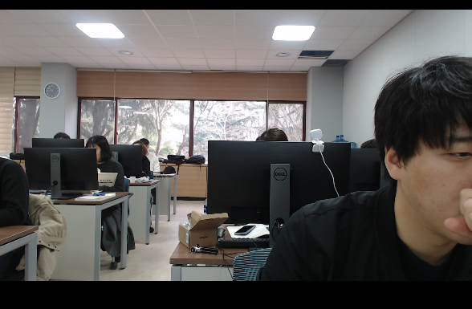
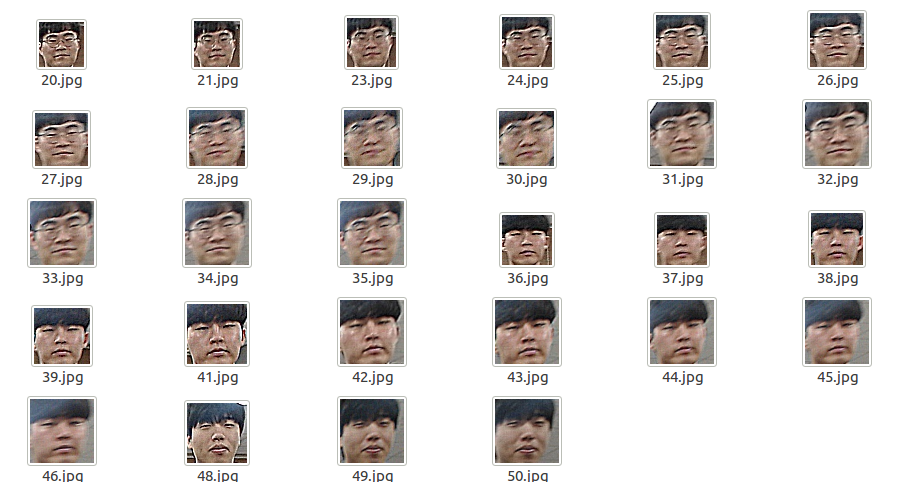

# Face_Detection_Using_Webcam

#### When we run the code, webcam runs like the picture below.  
  

#### If the webcam detect the face, the code will save the cropped image like the picture below.  

Run Code : python face_detecting_using_webcam.py

